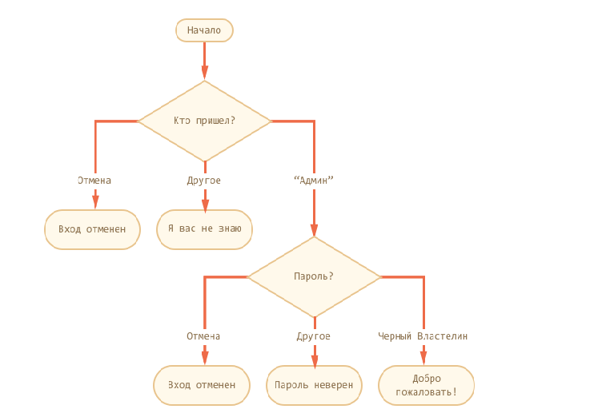

# Домашняя работа

# Читаем информационные ресурсы:
 * https://learn.javascript.ru/switch
 * https://learn.javascript.ru/operators
 * https://developer.mozilla.org/ru/docs/Web/JavaScript/Reference/Operators/typeof
 * http://learn.javascript.ru/external-script
 * https://developer.mozilla.org/ru/docs/Web/JavaScript/Reference/Statements/if...else

# Практика

 1. Реализовать скрипт согласно схеме:
     

 2. Запросить у пользователя число - проверить кратнос ли заданное числу трем; если нет, вывести остаток в консоль.

 3. Пользователь вводит из три значения, найти какое из них максимальное и  вывести его на экран.

 4. Запросить у пользователя значение, проверить является ли данное значение числом

 

